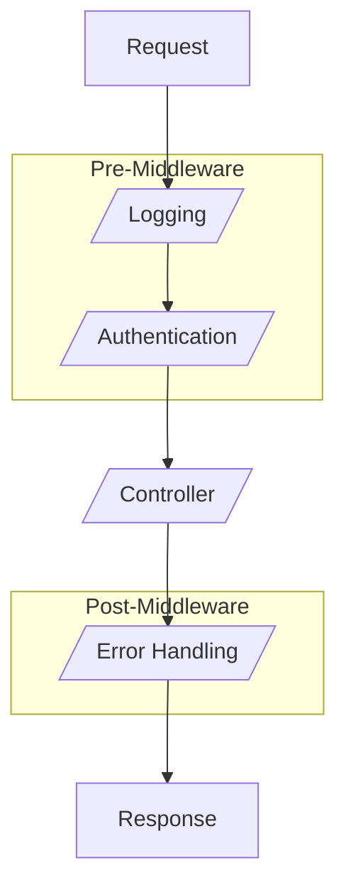

# Concepts

In SQListe, the main idea is to allow a SQL developer to define a web service powered by the DBMS through stored procedures.

## Input/Output of Procedures

A SQListe procedure takes a defined list of standard parameters (all optional). It then returns these parameters using a _SELECT_ statement with the same name.

In the case of a pipeline, the parameters retrieved at the output of step _x_ become the parameters of step _x+1_.
If a procedure doesn't return a parameter that was injected, its value will remain unchanged when passed to the next procedure.

:::note

This applies only to standard parameters.<br/>
Custom parameters, such as those from the route, are not affected.

:::

## Procedure Pipeline

A pipeline is a sequence of steps that are executed in a defined order to reach a final state.

In our case, this corresponds to the execution of procedures that act as middleware **before** and **after** 
the procedure that actually performs the request's purpose.

It can be summarized by the following diagram:



Two types of procedures emerge from this diagram: controllers and middleware.

## Controllers

In our case, a controller is a component responsible for orchestrating the business logic required to transform an HTTP request into an HTTP response.

## Middlewares

Middleware is a component that allows for the common logic to be shared among several more specific components.<br/>
Within SQListe, middleware can be executed before (pre-middleware) or after (post-middleware) a controller.

Some examples of middleware usage:
- Verify if the user is authenticated, has the right to access certain resources, and return an error with a 401 or 403 status code accordingly.
- Log a request.
- Catch unhandled errors and format the HTTP response accordingly.

## Annotations

Annotations in SQListe are keywords preceded by a _#_ character, commented above a procedure, with optional arguments. They are used to configure the processing that SQListe will apply to a procedure.

Example: 
```sql
-- Annotations can coexist with regular comments ;)
-- #Route("/api/helloWorld")
-- #HttpGet
CREATE OR ALTER PROCEDURE [web].[p_proc]...
```

Arguments can be passed to annotations in two ways:
- Ordered : #Annotation("1", false, 3) where the order of the parameters is important and none of them can be omitted.
- Named : #Annotation(Param2 = 2, Param1 = "1") where the order of the parameters is arbitrary, and parameters with default values can be omitted.

:::info

Passing parameters in ordered mode is recommended when the annotation has only a few parameters. However, if it has more than two parameters, it is better to use named mode.

:::

:::tip

Annotations are processed independently, so their order doesn't matter.

:::
