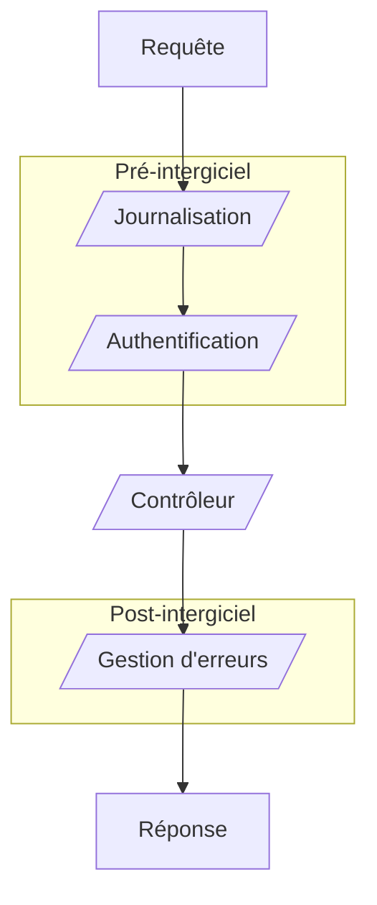

# Concepts

Dans SQListe, l'idée principale est de permettre à un développeur SQL de définir un 
service web propulsé par le SGBD à travers des procédures stockées.

## Entrée / sortie des procédures

Une procédure SQListe prend une liste de paramètres standard définie (tous facultatifs).
Elle retourne ensuite ces paramètres, via un _SELECT_ avec le même nom.

Dans le cas d'un _pipeline_, les paramètres récupérés à la sortie d'une étape _x_ deviendront les paramètres de l'étape _x+1_.
Si une procédure ne retourne pas un paramètre ayant été injecté, sa valeur restera inchangée lorsqu'il sera passé à la procédure suivante.

:::note

Ceci n'est valable que pour les paramètres standards.<br />
Les paramètres personnalisés tels que ceux issus de la route ne sont pas concernés.

:::

## Pipeline de procédures

Un _pipeline_ est un enchaînement d'étapes s'exécutant dans un ordre défini
afin d'arriver à un état final.

Dans notre cas, cela va correspondre à l'exécution de procédures allant jouer le rôle d'intergiciels **avant**
la procédure exécutant réellement l'objet de la requête, ainsi qu'après.

Cela se résume par le schéma suivant :



Deux types de procédure ressortent de ce schéma : les contrôleurs et les intergiciels.

## Contrôleurs

Dans notre cas, un contrôleur est un composant chargé d'orchestrer la logique métier nécessaire à transformer une requête HTTP en réponse HTTP.


## Intergiciels

Un intergiciel est un composant permettant de mutualiser une logique commune à plusieurs autres composants plus spécifiques.<br/>
Au sein de SQListe, ceux-ci peuvent être exécutés avant (pré-intergiciel) ou après (post-intergiciel) un contrôleur.

Quelques exemples d'utilisation :
- Vérifier que l'utilisateur est authentifié, qu'il a le droit d'accéder à certaines ressources, et renvoyer une erreur avec un statut 401 ou 403 selon le cas ;
- Journaliser une requête ;
- Attraper les erreurs non gérées, et formatter la réponse HTTP en conséquence.


## Annotations

Les annotations prennent la forme d'un mot clé précédé d'un _#_ mis en commentaires au-dessus d'une procédure, avec d'éventuels arguments.<br/>
Elles servent à paramétrer le traitement que SQListe va appliquer à une procédure. 

Exemple : 
```sql
-- L'écriture d'annotations n'empêche pas la présence de commentaires ;)
-- #Route("/api/helloWorld")
-- #HttpGet
CREATE OR ALTER PROCEDURE [web].[p_proc]...
```

Le passage d'arguments aux annotations peut se faire de deux manières :
- de manière ordonnée : #Annotation("1", false, 3) où l'ordre des paramètres est important et où aucun d'entre eux ne peut être omis.
- de manière nommée : #Annotation(Param2 = 2, Param1 = "1") où l'ordre des paramètres est libre, et où les paramètres ayant une valeur par défaut peuvent-être omis.

:::info

Le passage de paramètres en mode ordonné est recommandé si l'annotation ne prend pas beaucoup de paramètres.<br/>
En revanche si elle en prend plus de deux, il vaut mieux passer les paramètres en mode nommé.

:::

:::tip

Les annotations étant traitées séparément leur ordre n'a aucune importance.

:::
